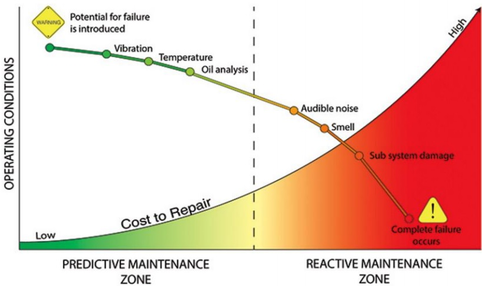

# Maintenance {#maintenance}

## Equipment Maintenance

설비 보전(equipment maintenance) 설비의 성능을 유지하기 위해서는 부품의 대체·보수 활동 등 보전 비용이 발생하는데, 이 보전 활동을 소홀히 하면 기계의 노후화·정지 등의 손실이 발생한다. 보전 비용, 노후화, 정지 손실 등의 비용을 최소로 하는 것을 설비 보전이라고 한다. 
<br>
<br>
<br>
```{r echo = F}

```

## Anomoaly Detection in Vibration
