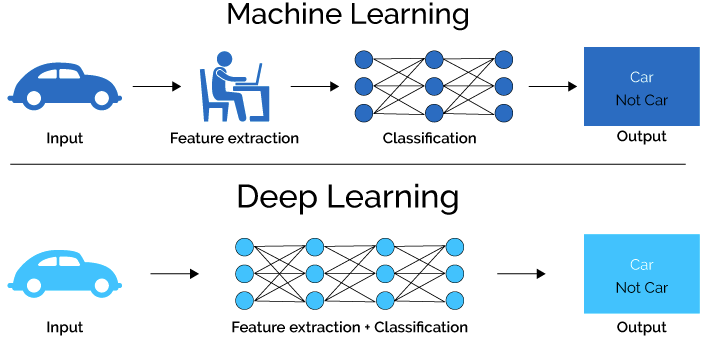
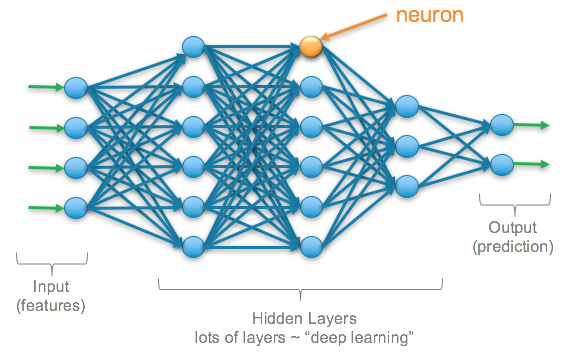
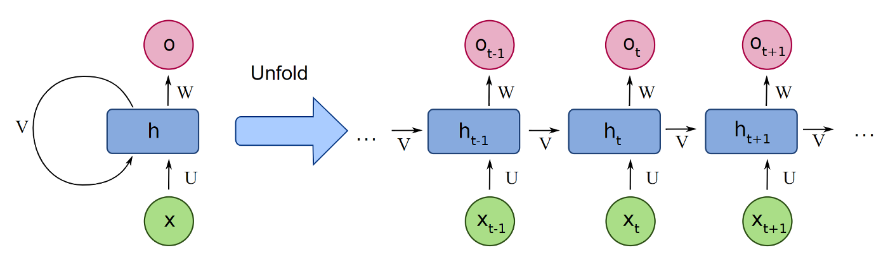
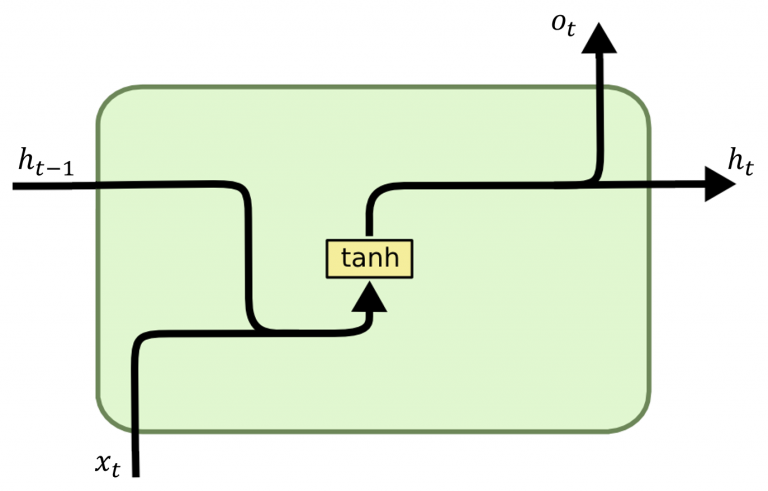
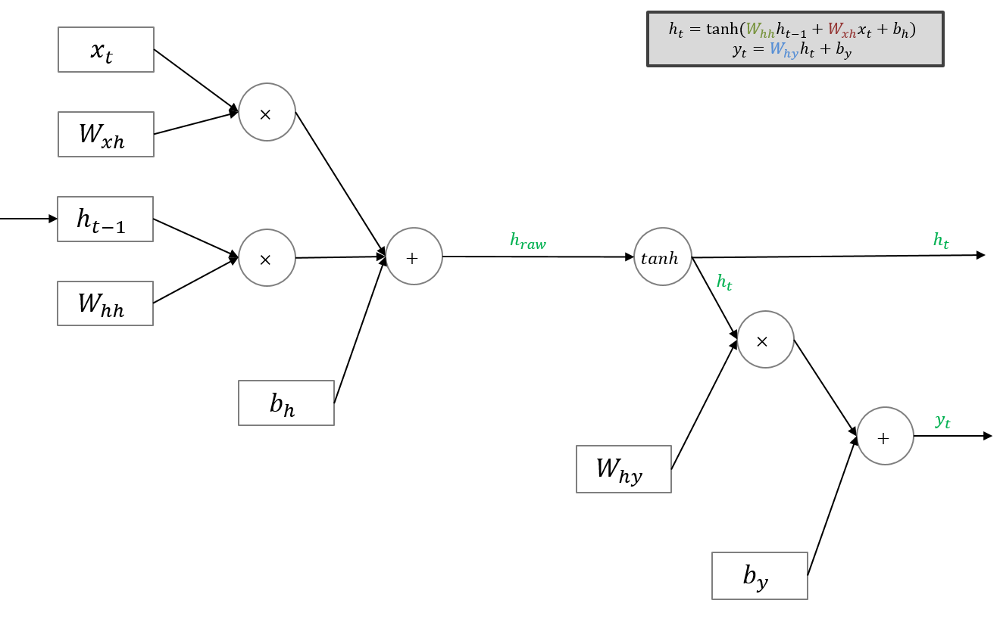
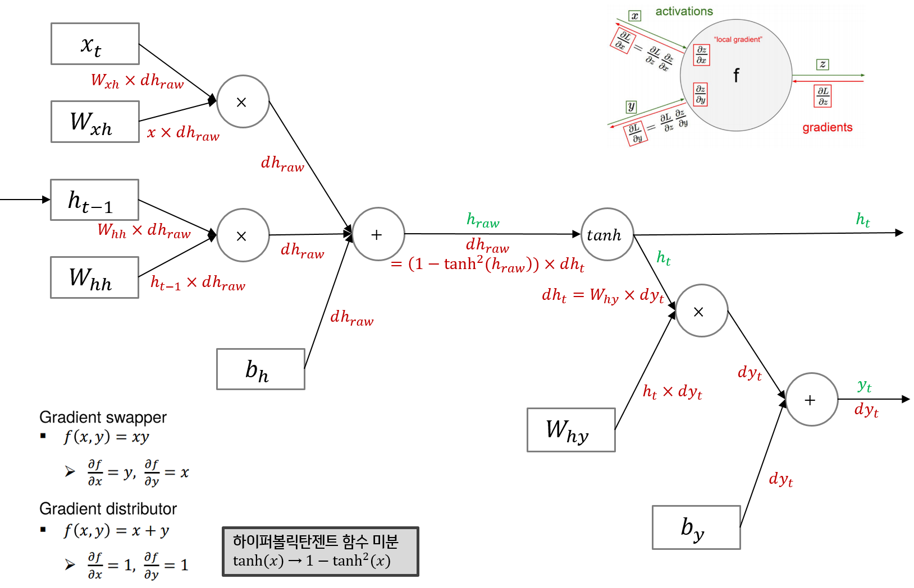
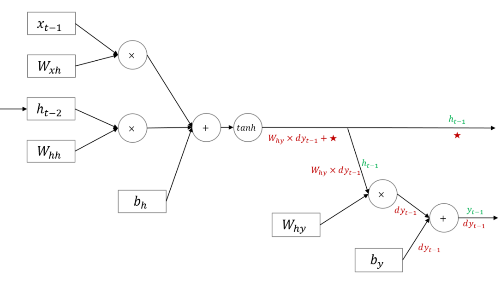
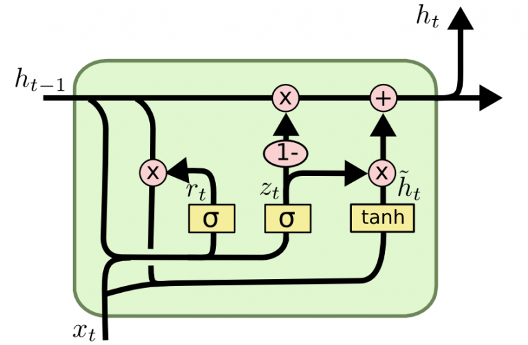
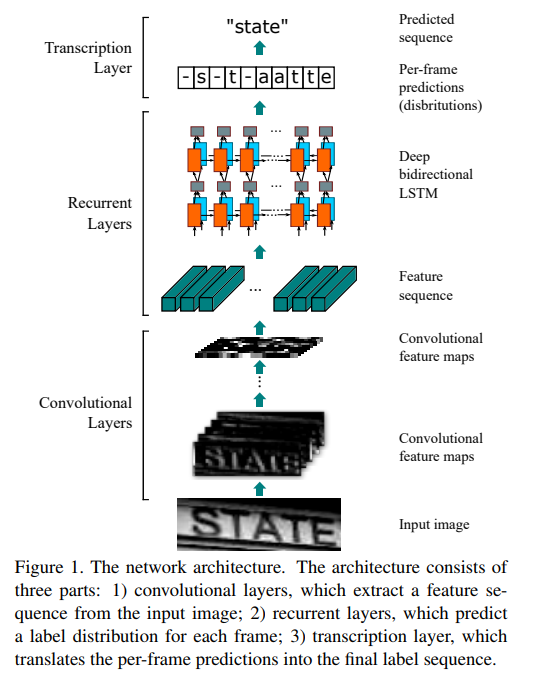
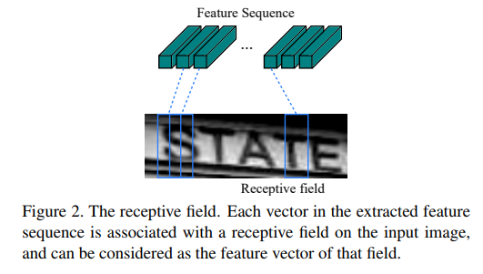

# How to Detect Anomaly {#how_to_detect_anomaly}

## Traditional Approach

### Real Time Monitoring

```{r echo = F}
knitr::include_graphics('./images/Chapter_02/monitoring.png')
```

### Fast Fourier Transforms (FFT)

```{r echo = F}
knitr::include_graphics('./images/Chapter_02/fft.jpg')
```

### Orbit Analysis

```{r echo = F}
knitr::include_graphics('./images/Chapter_02/orbit.jpg')
```


## Deep Learning Approach

### Deep Learning

#### What is Deep Learning?

```{r echo = F, fig.cap = 'Difference between ML and DL', fig.align = 'center'}

```
```{r echo = F, out.width = 700, fig.cap = 'Deep Learning Architecture', fig.align = 'center'}

```

여러 비선형 변환기법의 조합을 통해 높은 수준의 추상화를 시도하는 기계 학습 알고리즘의 집합 으로 정의되며, 큰 틀에서 사람의 사고방식을 컴퓨터에게 가르치는 기계학습의 한 분야라고 이야기할 수 있다.

#### What is CNN?

```{r echo = F, out.width = 700, fig.cap = 'Deep Learning Architecture', fig.align = 'center'}
knitr::include_graphics('./images/Chapter_03/cnn.jpeg')
```

합성곱 신경망(Convolutional Neural Network, CNN)은 시각적 이미지를 분석하는 데 사용되는 깊고 피드-포워드적인 인공신경망의 한 종류이다. 딥 러닝에서 심층 신경망으로 분류되며, 시각적 이미지 분석에 가장 일반적으로 적용된다. 또한 공유 가중치 구조와 변환 불변성 특성에 기초하여 변이 불변 또는 공간 불변 인공 신경망 (SIANN)으로도 알려져 있다. 이미지 및 비디오 인식, 추천 시스템, 이미지 분류, 의료 이미지 분석 및 자연어 처리에 응용된다. <br>

CNN은 정규화 된 버전의 다층 퍼셉트론이다. 다층 퍼셉트론은 일반적으로 완전히 연결된 네트워크, 즉 한 계층의 각 뉴런이 다음 계층의 모든 뉴런에 연결됨을 의미한다. 이러한 네트워크의 "완전히 연결"은 주어진 데이터에 과적합 되는 경향이 있다. 일반적인 정규화 방법에는 손실 함수에 몇 가지 형태의 가중치 측정을 추가하는 것이 포함되지만, CNN은 정규화를 향한 다른 접근 방식을 취한다. 데이터에서 계층적 패턴을 활용하고 더 작고 간단한 패턴을 사용하여 더 복잡한 패턴을 조립한다. 따라서 연결성과 복잡성의 규모에서 CNN은 극단적으로 낮다. <p>

컨볼 루션 네트워크는 뉴런 사이의 연결 패턴이 동물 시각 피질의 조직과 유사하다는 생물학적 과정에 의해 영감을 받았다. 개별 피질 뉴런은 수용장으로 알려진 시야의 제한된 영역에서만 자극에 반응한다. 상이한 뉴런의 수용 필드는 전체 시야를 커버하도록 부분적으로 중첩된다. <p>

CNN은 다른 이미지 분류 알고리즘에 비해 상대적으로 전처리를 거의 사용하지 않는다. 이는 네트워크가 기존 알고리즘에서 수작업으로 제작된 필터를 학습한다는 것을 의미한다. 피처 디자인에 대한 사전 지식과 인간 노력과의 독립성은 CNN의 주요한 장점다. <p>

#### What is RNN?

```{r echo = F, out.width = 700, fig.cap = 'RNN Architecture', fig.align = 'center'}

```

순환 인공 신경망(Recurrent Neural Network, RNN)은 인공 신경망의 한 종류로, 유닛간의 연결이 순환적 구조를 갖는 특징을 갖고 있다. 이러한 구조는 시변적 동적 특징을 모델링 할 수 있도록 신경망 내부에 상태를 저장할 수 있게 해준다. 전방 전달 신경망과 달리, 순환 인공 신경망은 내부의 메모리를 이용해시퀀스 형태의 입력을 처리할 수 있다. 따라서 순환 인공 신경망은 필기체 인식이나 음성 인식과 같이 시변적 특징을 가지는 데이터를 처리할 수 있다. RNN은 블록의 처리 방식에 따라 크게 다음 3가지로 구분한다. 

##### RNN (Recurrent Neural Networks)

```{r echo = F, out.width = 700, fig.cap = 'RNN Cell', fig.align = 'center'}

```

<h4> Notation </h4>
$x_{t}$ : input vector ($m$ x 1). <br>
$h_{t}$ : hidden layer vector ($n$ x 1). <br>
$o_{t}$ : output vector ($n$ x 1). <br>
$b_{h}$ : bias vector ($n$ x 1). <br>
$U,W$ : parameter matrices ($n$ x $m$). <br>
$V$ : parameter matrix ($n$ x $n$). <br>
$\sigma_{h}, \sigma_{y}$ : activation functions. <br>

<h4> Feedforward </h4>

```{r echo = F, out.width = 700, fig.cap = 'RNN Feedforward', fig.align = 'center'}

```
\[ h_t=\sigma_h(i_t)=\sigma_h(U_hx_t+V_hh_{t-1}+b_h) \]
\[ y_t=\sigma_y(a_t)=\sigma_y(W_yh_t+b_h) \]
  
<h4> Backpropagation </h4>

```{r echo = F, out.width = 700, fig.cap = 'RNN Backpropagation', fig.align = 'center'}

```

```{r echo = F, out.width = 700, fig.cap = 'RNN Backpropagation 2', fig.align = 'center'}

```

\[ \Pi_t= \frac{\partial E_t}{\partial o_t} \frac{\partial o_t}{\partial h_t}+ \frac{\partial h_{t+1}}{\partial h_t} \Pi_{t+1} \]
\[ \beta_t^U=\beta_{t+1}^U+\Pi_t \frac{\partial h_t}{\partial U_t} \]
\[ \beta_t^V=\beta_{t+1}^V+\Pi_t \frac{\partial h_t}{\partial V_t} \]
\[ \beta_t^W=\beta_{t+1}^W+ \frac{\partial E_t}{\partial o_t} \frac{\partial o_t}{\partial W_t} \]
\[ \frac{\partial E}{\partial X} \equiv \beta_0^x \] <br>

##### LSTM (Long Short-Term Memory)

```{r echo = F, out.width = 700, fig.cap = 'LSTM Cell', fig.align = 'center'}
knitr::include_graphics('./images/Chapter_03/lstm_cell.png')
```

<h4> Notation </h4>
$h_t, C_t$ : hidden layer vectors. <br>
$x_t$ : input vector. <br>
$b_f, b_i, b_c , b_o$ : bias vector. <br>
$W_f , W_i , W_c , W_o$ : parameter matrices. <br>
$\sigma , \tanh$ : activation functions. <br>

<h4> Feed Forward </h4>
\[ f_t=\sigma(W_f\cdot[h_{t-1},x_t]+b_f) \]
\[ i_t=\sigma(W_i\cdot[h_{t-1},x_t]+b_i) \]
\[ o_t=\sigma(W_o\cdot[h_{t-1},x_t]+b_o) \]
\[ \tilde{C}_t=\tanh(W_c\cdot[h_{t-1},x_t]+b_c) \]
\[ C_t=f_t\odot C_{t-1}+i_t\odot\tilde{C}_t \]
\[ h_t=o_t\odot\tanh(C_t) \]

<h4> Backpropagation </h4>
\begin{align*} &\frac{\partial C_{t+1}}{\partial h_t}= \frac{\partial C_{t+1}}{\partial \tilde{C}_{t+1}} \frac{\partial \tilde{C}_{t+1}}{\partial h_t}+ \frac{\partial C_{t+1}}{\partial f_{t+1}} \frac{\partial f_{t+1}}{\partial h_t}+ \frac{\partial C_{t+1}}{\partial t_{t+1}} \frac{\partial i_{t+1}}{\partial h_t}\\ &\frac{\partial C_{t+1}}{\partial C_t}\\ &\frac{\partial h_{t+1}}{\partial C_t}= \frac{\partial h_{t+1}}{\partial C_{t+1}} \frac{\partial C_{t+1}}{\partial C_t}\\ &\frac{\partial h_{t+1}}{\partial h_t}= \frac{\partial h_{t+1}}{\partial C_{t+1}} \frac{\partial C_{t+1}}{\partial h_t}+ \frac{\partial h_{t+1}}{\partial o_{t+1}} \frac{\partial o_{t+1}}{\partial h_t} \end{align*}
\[ \Pi_t= \frac{\partial E_t}{\partial h_t}+ \frac{\partial h_{t+1}}{\partial h_t} \Pi_{t+1}+ \frac{\partial C_{t+1}}{\partial h_t} \mathcal{T}_{t+1} \]
\[ \mathcal{T}_t= \frac{\partial E_t}{\partial h_t} \frac{\partial E_t}{\partial C_t}+ \frac{\partial h_{t+1}}{\partial C_t} \Pi_{t+1}+ \frac{\partial C_{t+1}}{\partial C_t} \mathcal{T}_{t+1} \]
\[ \beta_t^f=\beta_{t+1}^f+ \frac{\partial C_t}{\partial f_t} \frac{\partial f_t}{\partial W_t^f} ( \frac{\partial h_t}{\partial C_t} \Pi_t + \mathcal{T}_t ) \]
\[ \beta_t^i=\beta_{t+1}^i+ \frac{\partial C_t}{\partial i_t} \frac{\partial i_t}{\partial W_t^i} ( \frac{\partial h_t}{\partial C_t} \Pi_t + \mathcal{T}_t ) \]
\[ \beta_t^c=\beta_{t+1}^c+ \frac{\partial C_t}{\partial \tilde{C}_{t}} \frac{\partial \tilde{C}_{t}}{\partial W_t^c} ( \frac{\partial h_t}{\partial C_t} \Pi_t + \mathcal{T}_t ) \]
\[ \beta_t^o=\beta_{t+1}^o+ \frac{\partial h_t}{\partial o_t} \frac{\partial o_t}{\partial W_t^o} ( \Pi_t ) \]

##### GRU (Gated Recurrent Unit)

```{r echo = F, out.width = 700, fig.cap = 'GRU Cell', fig.align = 'center'}

```

<h4> Notation </h4>
$h_t$ : hidden layer vectors. <br>
$x_t$ : input vector. <br>
$b_z , b_r , b_h$ : bias vector. <br>
$W_z , W_r , W_h$ : parameter matrices. <br>
$\sigma , \tanh$ : activation functions. <br>

<h4> Feed Forward </h4>
\[ z_t=\sigma(W_z \cdot[h_{t-1},x_t]+b_z) \]
\[ r_t=\sigma(W_r \cdot [h_{t-1},x_t]+b_r) \]
\[ \tilde{h}_t=\tanh(W_h\cdot[r_t \odot h_{t-1},x_t]+b_h) \]
\[ h_t=(1-z_t)\odot h_{t-1}+z_t\odot \tilde{h}_t \]

<h4> Backpropagation </h4>
\[ \frac{\partial h_{t+1}}{\partial h_t}= \frac{\partial h_{t+1}}{\partial h_t}+ \frac{\partial h_{t+1}}{\partial z_{t+1}} \frac{\partial z_{t+1}}{\partial h_t}+ \frac{\partial h_{t+1}}{\partial \tilde{h}_{t+1}} ( \frac{\partial \tilde{h}_{t+1}}{\partial h_t}+ \frac{\partial \tilde{h}_{t+1}}{\partial r_{t+1}} \frac{\partial r_{t+1}}{\partial h_t} ) \]
\[ \Pi_t= \frac{\partial E_t}{\partial h_t}+ \frac{\partial h_{t+1}}{\partial h_t} \Pi_{t+1} \]
\[ \beta_t^z=\beta_{t+1}^z+ \frac{\partial h_t}{\partial z_t} \frac{\partial z_t}{\partial W_t^z} \Pi_t \]
\[ \beta_t^r=\beta_{t+1}^r+ \frac{\partial h_t}{\partial \tilde{h}_t} \frac{\partial \tilde{h}_t}{\partial r_t} \frac{\partial r_t}{\partial W_t^r} \Pi_t \]
\[ \beta_t^h=\beta_{t+1}^h+ \frac{\partial h_t}{\partial \tilde{h}_t} \frac{\partial \tilde{h}_t}{\partial W_t^h} \Pi_t \]

#### What is CRNN?

```{r echo = F, out.width = 700, fig.cap = 'CRNN Architecture', fig.align = 'center', fig.cap = ''}

```

```{r, echo = F, out.width = 700, fig.cap = 'Feature Sequence', fig.align = 'center', fig.subcap = 'An End-to-End Trainable Neural Network for Image-based Sequence Recognition and Its Application to Scene Text Recognition'}

```

### Applications
