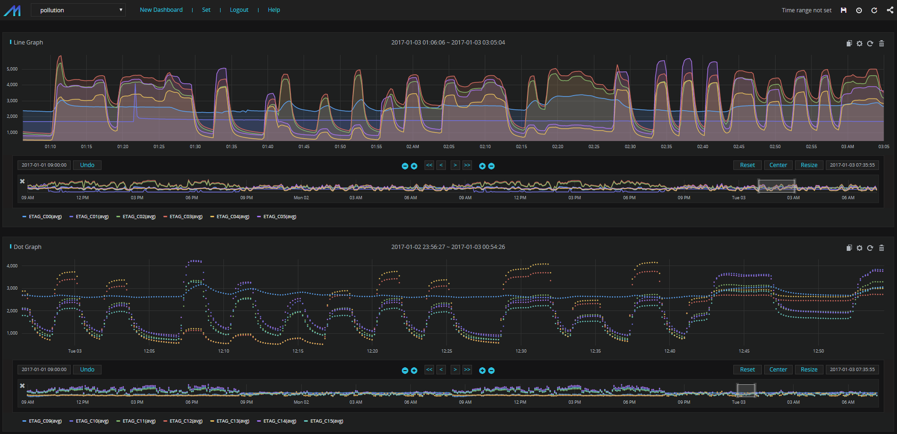
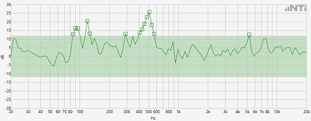
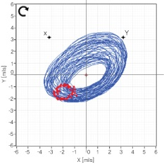

# How to Detect Anomaly {#how_to_detect_anomaly}

## Traditional Approach

### Real Time Monitoring

```{r echo = F}

```

### Fast Fourier Transforms (FFT)

```{r echo = F}

```

### Orbit Analysis

```{r echo = F}

```


## Deep Learning Approach

### Deep Learning

#### What is Deep Learning?

#### What is CNN?

```{r echo = F, out.width = 700, fig.cap = 'Deep Learning Architecture', fig.align = 'center'}
knitr::include_graphics('./images/Chapter_03/cnn.jpeg')
```

#### What is RNN?

#### What is CRNN?

### Applications
