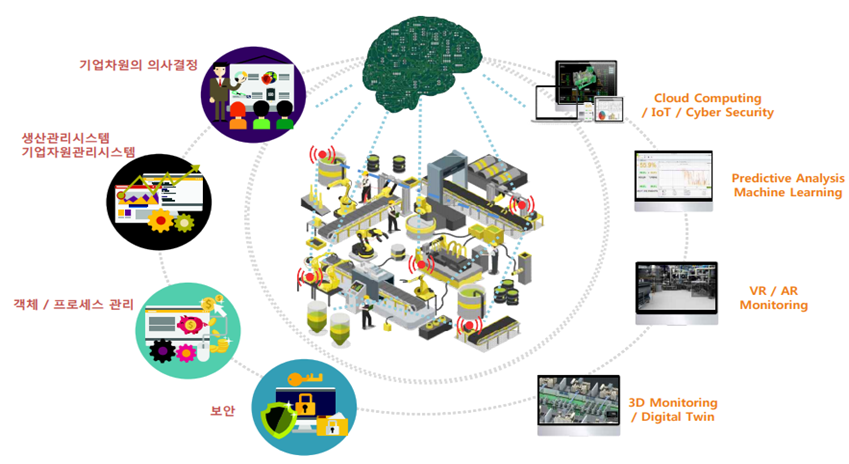

--- 
title: "Condition Based Maintenance for Smart Factory"
author: "Jihwan Min"
date: "`r Sys.Date()`"
site: bookdown::bookdown_site
documentclass: book
bibliography: [book.bib, packages.bib]
biblio-style: apalike
link-citations: yes
description: "This is a guide book about condition based maintenance for smart factory by using deep learning"
---

# Preface


4차 산업 혁명과 함께 설비 관리에 대한 개념도 바뀌기 시작하였다. 기존 시간기준정비(TBM) 방식에서는 
설비 진단 시스템 및 기술의 부재와 고장 발생 전 예측 정비 불가로 고장 발생 시 정비 기간 및 정비 비용 지출이 많았고
이를 위한 예방 정비 차원에서 관련 인력 유지 및 관리로 인한 상당한 비용이 소비되었다. <br>
하지만 4차 산업 혁명과 함께 IT기반 예측진단 시스템이 구축되어 실시간으로 장비의 상황을 확인할 수 있게 되었고 이로 정비기간 단축 및 정비 비용 감소를 이룰 수 있게 되었다. 이를 상태기준정비(CBM)라고 하는데 이를 달성하기 위한
기술을 알아보는 것을 목표로 한다. <br>


<h4> 스마트 팩토리 </h4>

```{r echo = F}

```

ICT 기술을 기반으로 공정 데이터를 수집, 분석하여 목적에 맞게 스스로 제어하는 공장 <br>


<h4> 스마트 팩토리 단계 </h4>

```{r echo = F}

```


<h4> 스마트 팩토리 구현 단계 및 핵심 기술 </h4>

```{r echo = F}

```


<h4> 스마트 팩토리 국내 현황 </h4>

```{r echo = F}

```


<h4> 발표 목표 </h4>

스마트 팩토리 중간1 진입을 위한 예지보전 시스템 및 알고리즘 구축 <br>

```{r echo = F}

```
